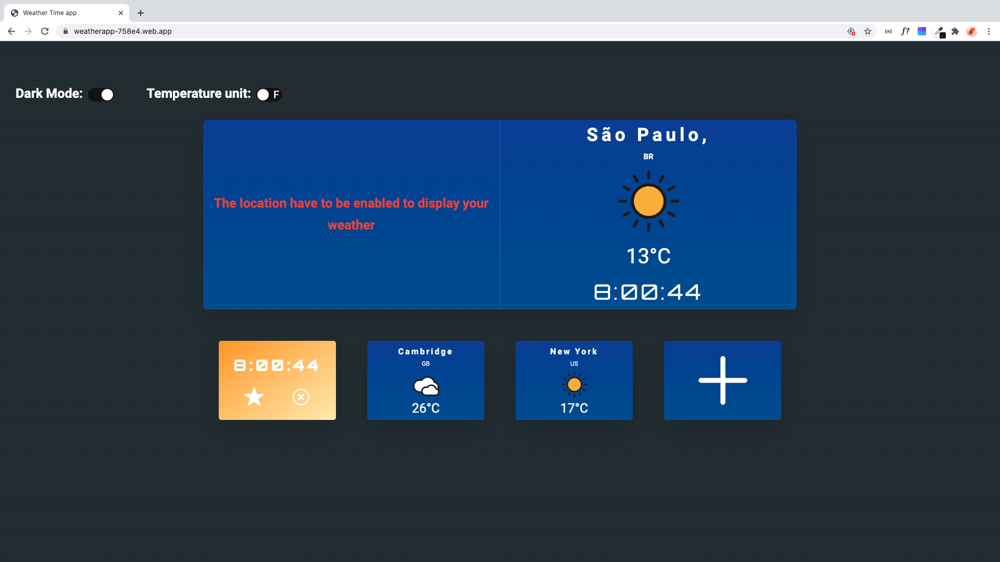

# My Weather App With City Clock
## [Check it here](https://weatherapp-758e4.web.app/)

Principal page of the Weather App  

Week forecast of a specific country/city  
## Getting Started
The database is made with a free API that you can find here: [OPEN WEATHER API](https://openweathermap.org/api) - All credits on API to them.   
### Installing
  
The project can be cloned and there's two steps to test the project and can be tested by yourself, with all of the changes that you want to do!  
  
Step 1: Run the next script to create a live local server and build in dev mode in real time  

```
npm run start  
```
  
Step 2: Buil the project to be ready for production

```
npm run build  
```
  
The commands above need to be introduced on the root folder of the project.  
  
The project need an API key as well that you can get it free from the OPEN WEATHER API. You just only need to change the api key on the models on the project.  
  
## Specifications
This project came when I was talking with one of my friends that actually lives far away from where I am currenctly living! We get different timezones and I don't know when is he up or when is he sleeping. I will use this every day because it's really helpfull to know when can I call him or not! The project was really challenging, I get a lot of stuck times, specially with the intervals to create the clock! Hope that you like it! To get the week forecast, just click on the city clock and it will redirect to the forecast page!  
The CSS is built without frameworks, neither flexbox, neither grid!   
## Built With
- HTML
- CSS3
- Vanilla JavaScript
- NodeJs:
	- webpack;
	- babel;
	- dotenv;  
## Contributing
Feel free to download it and improve it. If you want just give a pull request with your changes and let me know what can be improved. Many thanks :D
## Pages
- [GitHub Page](https://github.com/BitInByte)
- [Instagram](https://www.instagram.com/bitinbyte/)
- [Twitter](https://twitter.com/BitInByte2)
## Authors
**BitInByte** - Development student and tech enthusiastic
